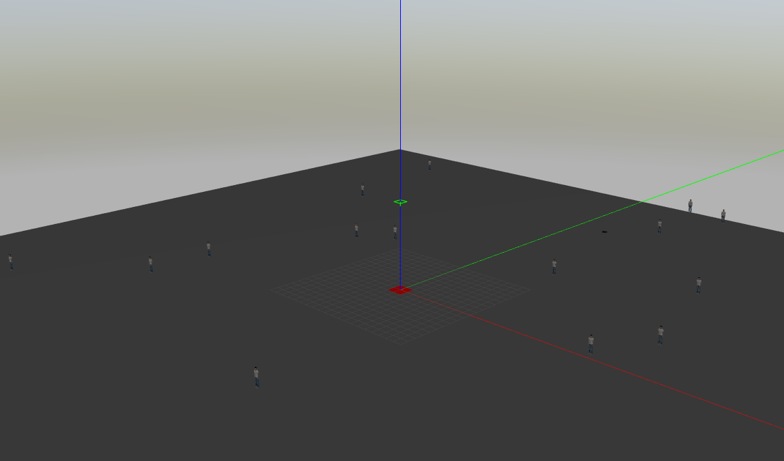

# Drone3D 

Drone3D is a C++ package used for drone rescuing randomly distributed survivors based on Gazebo and ROS-1. This package adopted the drone controller program of [sjtu-drone](https://github.com/tahsinkose/sjtu-drone) and has beed tested in Ubuntu 20.04.

The package first create a world with a drone landed at the centre red plate. Then multiple survivors are generated at random positions. The shortest route for traversing all survivors is calculated using RoutePlanner class. Drone would follow this route to visit each survivor and finally return to its initial position.



## Program structure

This package contains a Gazebo world plugin i.e., `SurvivorsPlugin`, and two C++ classes, i.e., `DroneObject` and `RoutePlanner`. It also contains `launch/drone3d.launch`, `urdf/sjtu_drone.urdf` and `worlds/survivors.world`, which are required components for simulating objects in Gazebo environment. 

In `SurvivorsPlugin`, a transport node is created to subscribe the survivor position message under the `/survivors/pose` topic published by the node in main() in `simulate.cpp`. After this message is published, it would then be subscribed by Gazebo to create the survivors in the simulated world. 

A ROS nodehandle is created in main() to create drones and control their behavior. The `DroneObject` class is created to ease the control of these drones. A shorest route that connect all survivors can be generated by the `RoutePlanner` class. 

## Rubric points

Following the Rubric points described in https://review.udacity.com/#!/rubrics/2533/view. Here only five criteria are listed to satisfy the requirements of Udacity.

* `Loops, Functions, I/O::The project demonstrates an understanding of C++ functions and control structures`: The package involves for... and while... loops and conditional expressions like if... structures. Expressions are also encapsulated into functions like the line-4 in simulate.cpp and the lambda like line-45 in route_planner.cpp.
* `Object Oriented Programming::The project uses Object Oriented Programming techniques`: The package is divided into several classes. 
* `Object Oriented Programming::Classes use appropriate access specifiers for class members`: Proper access specifiers are used in header files like `drone_object.h` and `route_planner.h`.
* `Object Oriented Programming::Class constructors utilize member initialization lists`: line-5 in route_planner.cpp.
* `Memory Management::The project makes use of references in function declarations`: e.g., line-4, line-36 in route_planner.cpp.

## Dependencies 
* Desktop version of ROS Noetic: Follow the instructions in this [site](http://wiki.ros.org/noetic/Installation/Ubuntu). Note one should do the "Desktop Install" and set-up proper environment variables.  
* Gazebo 11: Follow the instructions [here](http://gazebosim.org/tutorials?tut=install_ubuntu). Then install gazebo-ros packages: `sudo apt-get install ros-noetic-gazebo-ros ros-noetic-gazebo-ros-pkgs ros-noetic-gazebo-ros-control`
* catkin: `sudo apt-get install python3-catkin-tools python3-osrf-pycommon`, then create a catkin workspace described in this [site](http://wiki.ros.org/catkin/Tutorials/create_a_workspace).
* Ignition Citadel: Follow the instructions [here](https://ignitionrobotics.org/docs/citadel/install_ubuntu).
* sjtu-drone package installed in catkin workspace (eg. ~/catkin_ws), clone and install the package following the instruction from [here](https://github.com/longfish/sjtu-drone):
* ```
$ cd <catkin_ws>/src
$ git clone https://github.com/longfish/sjtu-drone.git
$ cd <catkin_ws>
$ catkin_make
```

## Cloning and compiling

Build this package in catkin workspace (must be the same as the one created in previous section):
```
$ cd <catkin_ws>/src
$ git clone https://github.com/longfish/drone3d.git 
$ cd <catkin_ws>
$ source devel/setup.bash
$ catkin_make
```

## Running

Launch the Gazebo world in the 1st terminal:
```
$ cd <catkin_ws>
$ source devel/setup.bash
$ roslaunch drone3d drone3d.launch
```

Simulate the survivor behavior and drone in the 2nd terminal:
```
$ cd <catkin_ws>
$ source devel/setup.bash
$ rosrun drone3d simulate
```
